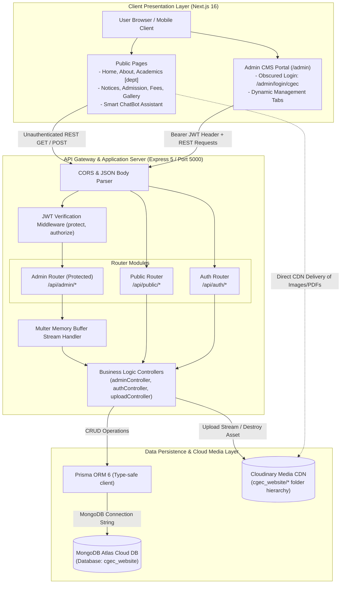

# Cooch Behar Government Engineering College (CGEC)
## Technical Documentation & System Specification

> **Target Version**: v1.0.0 (Release)  
> **Repository**: [CGEC-Website](https://github.com/Tanmoy052/CGEC-Website)  
> **Last Updated**: March 2026  

---

## 1. Executive Summary & Technology Stack

The **CGEC Web Platform** is an enterprise-grade academic management and public information portal built for Cooch Behar Government Engineering College (Government of West Bengal, AICTE approved, MAKAUT affiliated). The platform serves dynamic academic departments, admissions, circulars, placement records, and campus media while providing institutional administrators with an authenticated content management dashboard.

### Core Tech Stack Matrix

| Layer | Technology | Key Capabilities & Rationale |
| :--- | :--- | :--- |
| **Frontend** | **Next.js 16 (App Router)** | Hybrid SSR/SSG rendering, SEO optimization, dynamic department routing |
| **Styling & UI** | **Tailwind CSS v4 & Framer Motion** | Custom responsive typography, modern glassmorphism, micro-animations |
| **Icons & Media** | **Lucide React** | Consistent lightweight vector iconography |
| **Backend API** | **Express.js 5 & Node.js 18+** | High-throughput asynchronous REST API, route modularization |
| **Database & ORM** | **MongoDB Atlas + Prisma ORM 6** | Document-oriented cloud database with type-safe schema modeling |
| **Media Storage** | **Cloudinary CDN (SDK v2)** | Multi-format asset optimization (Images, Raw PDFs), stream uploads |
| **Auth & Security** | **JWT & Bcrypt.js** | Stateless HMAC SHA-256 tokens, salted password hashing, obscured admin route |

---

## 2. Full Application Architecture

The system operates as an integrated monorepo workspace containing independent client and server runtimes connected over authenticated HTTP/REST.



---

## 3. Database Management & Schema Design

Database operations are orchestrated through **Prisma ORM 6** targeting **MongoDB Atlas**. MongoDB's schema flexibility is paired with Prisma's strict compile-time type generation.

### High-Level Entity & Data Management Diagram

```mermaid
erDiagram
    User ||--o{ Notice : publishes
    User {
        ObjectId id PK
        String email UK
        String password
        String name
        Role role "STUDENT | FACULTY | ADMIN"
        String dept
        DateTime createdAt
    }

    Faculty {
        ObjectId id PK
        String name
        String designation
        String department "CSE | ECE | EE | ME | CE | BSH"
        String email UK
        String phone
        String experience
        String[] specialization
        String[] qualifications
        String image
        String imagePublicId
        String cvLink
        String cvPublicId
        String[] publications
    }

    Syllabus {
        ObjectId id PK
        String department
        String semester "1st-8th | All"
        String title
        String pdfLink
        String pdfPublicId
        String academicYear
    }

    Lab {
        ObjectId id PK
        String department
        String name
        String description
        String image
        String roomNumber
        String facultyInCharge
    }

    Notice {
        ObjectId id PK
        String title
        String content
        String category "General | Academic | Tender | Recruitment"
        String priority "NORMAL | HIGH | URGENT"
        String attachment
        String attachmentPublicId
        String authorName
        String department
        DateTime expiryDate
    }

    AdmissionItem {
        ObjectId id PK
        String year
        String category "NOTICE | DOCUMENT"
        String title
        String fileUrl
        String filePublicId
        Int order
    }

    AdmissionConfig {
        ObjectId id PK
        String year UK
        String whatsappLink
        String contactPhone
        String contactEmail
        String officerName
        Boolean isActive
    }

    FeeItem {
        ObjectId id PK
        String academicYear
        String admissionType "REGULAR | LATERAL"
        String slNo
        String feeHead
        String cseEce
        String core
        Int order
    }

    CommitteeMember {
        ObjectId id PK
        String committee "academic | anti-ragging | icc | iic | iqac | grc | sc-st ..."
        String name
        String position
        String department
        String email
        Int order
    }

    PlacementBrochure {
        ObjectId id PK
        String title
        String academicYear
        String fileUrl
        String filePublicId
        String fileType
        String fileSize
        Boolean isActive
        Int order
    }

    Recruiter {
        ObjectId id PK
        String name
        String logo
        String logoPublicId
        String website
        Int order
    }

    LeadershipMessage {
        ObjectId id PK
        String name
        String role "Principal | Registrar | etc."
        String message
        String image
        Int order
    }

    HodMessage {
        ObjectId id PK
        String department UK
        String name
        String designation
        String message
        String image
    }

    Gallery {
        ObjectId id PK
        String title
        String category "Campus | Events | Sports | Cultural"
        String imageUrl
        String imagePublicId
    }

    WallMagazine {
        ObjectId id PK
        String title
        String edition
        String year
        String imageUrl
        String pdfLink
        String department
    }

    ContactMessage {
        ObjectId id PK
        String name
        String email
        String subject
        String message
        DateTime createdAt
    }
```



### Key Data Invariants & Management Policies

1. **Deterministic Public ID Tracking**: Every media-bearing document (`Faculty`, `Notice`, `Syllabus`, `Gallery`, `WallMagazine`, `PlacementBrochure`, `AdmissionItem`, `Recruiter`, `LeadershipMessage`, `HodMessage`) retains both its Cloudinary CDN `fileUrl` and its Cloudinary `publicId`.
2. **Cloudinary-First Deletion Strategy**: To prevent dangling media on the cloud, deletion workflows invoke `cloudinary.uploader.destroy(publicId)` before the database record is removed. If deletion fails or the ID is missing, error traps ensure server stability.
3. **Audit Timestamps**: All core entities feature `@default(now()) createdAt` and `@updatedAt updatedAt` fields for auditing.

---

## 4. Key Subsystems & Workflows

### 4.1. Cloudinary Asset Stream Lifecycle
Files are streamed through Express into Cloudinary without persisting temporary files to disk:
```
Client (FormData) ──> Multer (MemoryStorage) ──> Readable Buffer Stream ──> Cloudinary SDK ──> Secure URL + Public ID
```
- **Images** (`jpg`, `png`, `webp`, `svg`): Uploaded under `resource_type: "image"`.
- **Documents** (`pdf`, `doc`, `docx`): Uploaded under `resource_type: "raw"`.

### 4.2. Obscured Authentication & RBAC
- **Admin Access**: Handled through the unadvertised route `/admin/login/cgec`.
- **Token Format**: Signed JSON Web Tokens containing user ID, email, name, and role (`ADMIN`).
- **Default Superadmin Seed**: On backend startup, `seedDefaultAdmin()` automatically creates the default administrator (`admin@cgec.org.in`) if no admin exists.

### 4.3. Dynamic Department Routing
The frontend implements dynamic route segments (`/academics/[dept]`) serving:
- Computer Science & Engineering (`cse`)
- Electronics & Communication Engineering (`ece`)
- Electrical Engineering (`ee`)
- Mechanical Engineering (`me`)
- Civil Engineering (`ce`)
- Basic Science & Humanities (`bsh`)

Each department dynamically aggregates HOD message, faculty roster, labs, syllabi, wall magazines, and research publications.

---

## 5. How to Start & How to Use (Developer Guide)

### 5.1. System Prerequisites
- **Node.js**: `v18.0.0` or higher (`v20+` recommended)
- **Package Manager**: `npm` v9+
- **MongoDB Atlas**: Free tier or dedicated cluster with an active connection URI
- **Cloudinary Account**: Cloud name, API key, and API secret

### 5.2. Installation & Workspace Setup

```bash
# 1. Clone the repository
git clone https://github.com/Tanmoy052/CGEC-Website.git
cd CGEC-Website

# 2. Install dependencies across root, frontend, and backend
npm run install:all
```

### 5.3. Environment Configuration

#### Backend Configuration (`backend/.env`)
```env
PORT=5000
DATABASE_URL="mongodb+srv://<username>:<password>@<cluster>.mongodb.net/cgec_website?retryWrites=true&w=majority"
JWT_SECRET="your-secure-jwt-secret-key-min-32-chars"
CLOUDINARY_CLOUD_NAME="your_cloud_name"
CLOUDINARY_API_KEY="your_cloudinary_api_key"
CLOUDINARY_API_SECRET="your_cloudinary_api_secret"
```

#### Frontend Configuration (`frontend/.env.local`)
```env
NEXT_PUBLIC_API_URL="http://localhost:5000/api"
NEXT_PUBLIC_PORTAL_URL="https://cgec-sms-portal.vercel.app/"
```

### 5.4. Database Synchronization

Generate the Prisma client and deploy schema to your MongoDB database:

```bash
cd backend
npx prisma generate
npx prisma db push
cd ..
```

### 5.5. Running in Development

From the repository root, start both Next.js and Express concurrently:

```bash
npm run dev
```

| Service | Port / URL | Function |
| :--- | :--- | :--- |
| **Frontend Portal** | [http://localhost:3000](http://localhost:3000) | Next.js App with hot reload |
| **Backend REST API** | [http://localhost:5000](http://localhost:5000) | Express Server with `ts-node-dev` |
| **Admin Login** | [http://localhost:3000/admin/login/cgec](http://localhost:3000/admin/login/cgec) | Obscured Admin Access Portal |

### 5.6. Admin Portal Credentials (Default Seed)
- **Email**: `admin@cgec.org.in`
- **Password**: `Admin@cgec2026`
*(Note: Change this immediately upon initial deployment under the Profile / Security tab).*

### 5.7. Building for Production

```bash
# Build backend TypeScript
cd backend
npm run build

# Build frontend Next.js bundle
cd ../frontend
npm run build
```

---

## 6. API Reference (High-Level Summary)

### Public Endpoints (`/api/public/*`)
- `GET /faculty` — Retrieve faculty by department (`?department=CSE`)
- `GET /syllabus` — Retrieve department syllabi by semester
- `GET /notices` — Retrieve active circulars and notices
- `GET /labs` — Retrieve department laboratory inventory
- `GET /gallery` — Retrieve campus photo gallery items
- `GET /wall-magazine` — Retrieve department wall magazine issues
- `GET /admission` — Retrieve admission notices and documents
- `GET /fees` — Retrieve regular and lateral fee tables
- `GET /committees` — Retrieve institutional committee member rosters
- `GET /leadership` — Retrieve executive leadership messages
- `GET /recruiters` — Retrieve placement recruiter logos
- `GET /brochures/latest` — Download the active placement brochure PDF
- `GET /hod-message` — Retrieve HOD message for departments
- `POST /contact` — Submit public inquiry or grievance message

### Protected Admin Endpoints (`/api/admin/*` — Requires `Authorization: Bearer <token>`)
- `POST /upload` — Stream media or PDF documents to Cloudinary
- `GET /stats` — Live system metrics and document counts
- `GET, POST, PUT, DELETE` on `/faculty`, `/syllabus`, `/notices`, `/labs`, `/gallery`, `/wall-magazine`, `/admission/*`, `/fees`, `/committees`, `/leadership`, `/recruiters`, `/brochures`, `/hod-message`
- `GET /messages`, `DELETE /messages/:id`, `POST /messages/batch-delete` — Review and moderate contact messages
- `GET, PUT /profile` — Update administrator profile credentials and password

---

## 7. Operational & Security Checklist

1. **CORS Enforcement**: Backend strictly whitelist origins (`http://localhost:3000` and production Vercel frontend).
2. **Zero Orphaned Media**: Always upload via `/api/admin/upload` and delete via the admin dashboard to trigger Cloudinary remote cleanup.
3. **Payload Sanitization**: File sizes capped at 100MB for brochures and PDFs; memory buffers automatically reclaimed after cloud stream completion.
