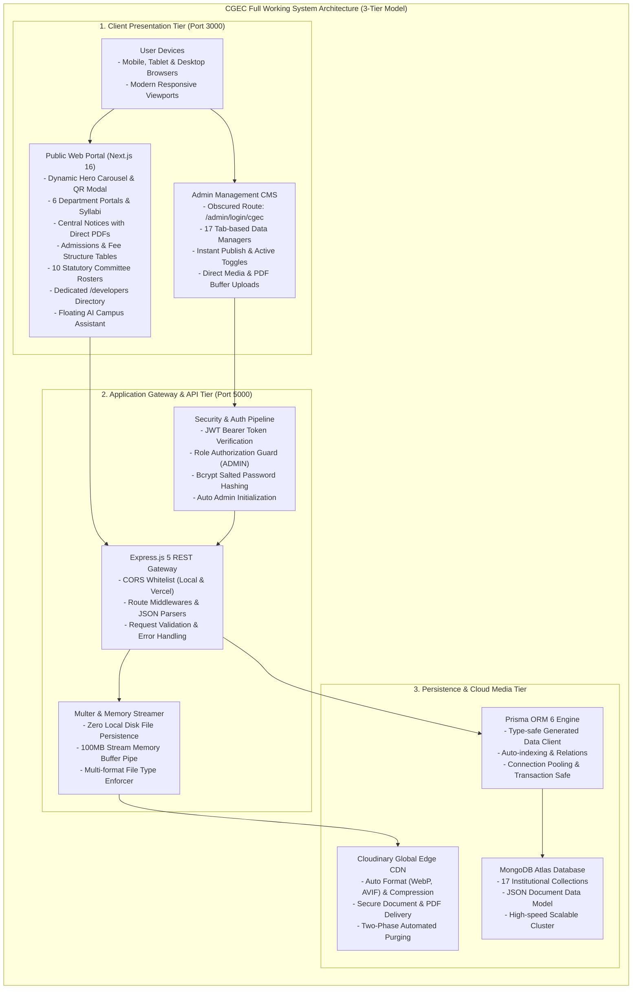
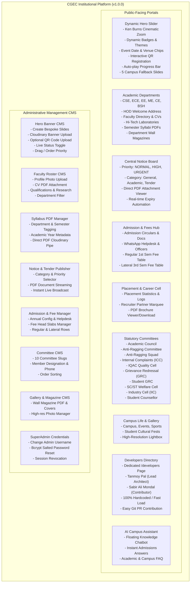

# Cooch Behar Government Engineering College (CGEC)
# Official Technical Specification & Comprehensive Project Report

> **Document Type**: Comprehensive Engineering & Architectural Specification  
> **Release Version**: `v1.0.0` (Initial Official Production Release)  
> **Institution**: Cooch Behar Government Engineering College *(Govt. of West Bengal, AICTE Approved, MAKAUT Affiliated)*  
> **Lead Developer & System Architect**: Tanmoy Pal *(CSE, Class of 2027)*  
> **Development Contributor**: Sabir Ali Mondal *(CSE, Class of 2027)*  
> **Repository**: [https://github.com/Tanmoy052/CGEC-Website](https://github.com/Tanmoy052/CGEC-Website)  
> **Date**: September 2026

---

## 1. Executive Summary

The **Cooch Behar Government Engineering College (CGEC) Web Platform** is an enterprise-grade academic management, public information dissemination, and administrative governance system. Built from the ground up to replace fragmented web utilities, this project establishes a unified digital ecosystem serving thousands of active students, faculty members, prospective applicants, recruiters, and administrative authorities.

The platform combines a **modern server-driven client layer (Next.js 16 App Router)** with a **high-throughput asynchronous API gateway (Express.js 5 / Node.js)**, backed by a **document-oriented cloud database (MongoDB Atlas)** managed through **Prisma ORM 6** and a **global media content delivery network (Cloudinary CDN)**.

### Core Engineering Objectives
1. **Decoupled Monorepo Architecture**: Strict separation of concerns between client rendering, RESTful business logic, cloud asset streaming, and persistence.
2. **Comprehensive Content Management System (CMS)**: An obscured, role-based administrative portal allowing non-technical institutional staff to manage faculty rosters, admission circulars, fee charts, syllabi, tenders, event sliders, and department messages in real time without code modifications.
3. **Zero Orphaned Media Policy**: In-memory buffer streaming combined with automated two-phase deletion ensures that whenever an institutional record is purged, its corresponding image, document, or PDF is destroyed from Cloudinary.
4. **Resilient Public Availability**: Seamless fallbacks ensuring that database timeouts or network latency never result in broken UI states or blank homepages.

---

## 2. Complete Technology Stack & Specifications

| Layer / Subsystem | Primary Technology | Exact Version | Strategic Engineering Rationale |
| :--- | :--- | :--- | :--- |
| **Frontend Framework** | **Next.js (App Router)** | `v16.1.6` | Hybrid SSG/SSR execution, Turbopack incremental bundling, built-in SEO metadata API, dynamic route caching. |
| **Client Core** | **React & TypeScript** | `v19.x` / `v5.x` | Strict compile-time type validation, functional component trees, concurrent rendering primitives. |
| **Styling & Design System**| **Tailwind CSS v4 & Vanilla CSS** | `v4.x` | Native CSS variable design tokens, zero-runtime overhead utility generation, custom glassmorphism. |
| **Micro-Animations** | **Framer Motion** | `v12.x` | Hardware-accelerated Ken Burns effects, crossfades, exit transitions, and auto-play indicator bars. |
| **Iconography** | **Lucide React** | `v1.x` | Feather-light SVG vector iconography with zero external webfont network overhead. |
| **Backend API Gateway** | **Express.js** | `v5.2.1` | Next-generation asynchronous request routing, promise-native middleware pipelines, robust error containment. |
| **Runtime Environment** | **Node.js** | `v18.0.0+` (LTS) | Asynchronous non-blocking I/O event loop for handling parallel file transfers and database transactions. |
| **Database Engine** | **MongoDB Atlas** | Document DB | Cloud-hosted NoSQL cluster providing flexible schema modeling for nested academic publications and arrays. |
| **Object-Relational Mapping**| **Prisma ORM** | `v6.19.2` | Compile-time generated TypeScript data client, automated indexing, transactional writes, and schema synchronization. |
| **Media & File Streaming** | **Cloudinary CDN SDK** | `v2.11.0` | Multi-format asset optimization (AVIF/WebP), streaming buffer pipes, direct document delivery. |
| **File Buffer Handling** | **Multer** | `v2.3.0` | In-memory stream interception without local disk persistence, preventing server storage leaks. |
| **Security & Cryptography** | **JWT & Bcrypt.js** | `v9.0.3` / `v3.0.3`| Stateless HMAC-SHA256 bearer tokens, cryptographically salted password hashing (10 salt rounds). |

---

## 3. Full Working Architecture Diagram

The system operates across three distinct tiers: **Client Presentation Tier**, **API Gateway & Middleware Tier**, and **Persistence & Cloud Media Tier**.



---

## 4. Full Features & Subsystems Diagram

Every feature of the CGEC platform is structured into clean institutional modules, serving both public users and administrative maintainers.



---

## 5. Full Unified Database Entity-Relationship Diagram

The complete MongoDB persistence model contains **17 distinct collections** managed strictly through **Prisma ORM 6**. All entities enforce strict typing, indexing, and cascade asset cleanup.

```mermaid
erDiagram
    User ||--o{ Notice : author
    
    User {
        ObjectId id PK
        String email UK "Unique administrator email"
        String password "Bcrypt salted hash"
        String name "Full administrator name"
        Role role "STUDENT | FACULTY | ADMIN (Default: STUDENT)"
        String dept "Optional department affiliation"
        DateTime createdAt "Audit creation timestamp"
        DateTime updatedAt "Audit update timestamp"
    }

    HeroSlide {
        ObjectId id PK
        String title "Slide main headline"
        String subtitle "Optional presenting department"
        String description "Detailed event / announcement text"
        String badge "e.g. HACKATHON, TECH FEST, ANNOUNCEMENT"
        String badgeColor "blue | purple | cyan | emerald | amber | rose"
        String bgImage "Cloudinary secure CDN URL"
        String bgImagePublicId "Cloudinary public ID for asset deletion"
        String primaryBtnText "CTA button label (e.g. Register Now)"
        String primaryBtnLink "Target URL (internal route or external link)"
        String secondaryBtnText "Secondary button label"
        String secondaryBtnLink "Secondary target URL"
        String eventDate "e.g. Oct 24 - 26, 2026"
        String venue "e.g. Main Auditorium & Central Labs"
        String qrCodeImage "Cloudinary URL for registration QR"
        String qrCodePublicId "Cloudinary public ID for QR deletion"
        Int order "Priority sequence index (0 = Top / First)"
        Boolean isActive "Publish toggle (Default: true)"
        DateTime createdAt
        DateTime updatedAt
    }

    Faculty {
        ObjectId id PK
        String name "Faculty full name"
        String designation "Professor, Assoc Prof, Asst Prof, etc."
        String department "CSE | ECE | EE | ME | CE | BSH"
        String email UK "Unique academic email"
        String phone "Contact number"
        String experience "Years of teaching/research experience"
        String[] specialization "List of specialized research domains"
        String[] qualifications "B.Tech, M.Tech, Ph.D degrees"
        String image "Cloudinary profile photo URL"
        String imagePublicId "Cloudinary public ID for photo cleanup"
        String cvLink "Cloudinary raw PDF download URL"
        String cvPublicId "Cloudinary public ID for CV cleanup"
        String[] publications "Indexed journal/conference papers"
        DateTime createdAt
        DateTime updatedAt
    }

    Notice {
        ObjectId id PK
        String title "Notice circular heading"
        String content "Detailed body text of notice"
        String category "General | Academic | Tender | Recruitment"
        String priority "NORMAL | HIGH | URGENT"
        DateTime expiryDate "Optional auto-expiry timestamp"
        String attachment "Cloudinary PDF attachment URL"
        String attachmentPublicId "Cloudinary public ID for PDF cleanup"
        String authorId "User ID of posting administrator"
        String authorName "Display name of posting authority"
        String department "Optional department tag"
        DateTime createdAt
        DateTime updatedAt
    }

    Syllabus {
        ObjectId id PK
        String department "CSE | ECE | EE | ME | CE | BSH"
        String semester "1st to 8th Semester | All Semesters"
        String title "Curriculum document title"
        String description "Optional summary of syllabus structure"
        String pdfLink "Cloudinary raw PDF URL"
        String pdfPublicId "Cloudinary public ID for PDF cleanup"
        String academicYear "e.g. 2024-2025"
        DateTime createdAt
        DateTime updatedAt
    }

    Lab {
        ObjectId id PK
        String department "CSE | ECE | EE | ME | CE"
        String name "Laboratory title (e.g. AI & Robotics Lab)"
        String description "Equipment and software capabilities"
        String image "Cloudinary laboratory photo URL"
        String imagePublicId "Cloudinary public ID for lab photo"
        String roomNumber "Room / Floor identification"
        String facultyInCharge "Name of supervising professor"
        DateTime createdAt
        DateTime updatedAt
    }

    AdmissionConfig {
        ObjectId id PK
        String year UK "Academic admission year (Default: 2025)"
        String whatsappLink "Official WhatsApp inquiry group invite"
        String contactPhone "Admission officer contact number"
        String contactEmail "Admission desk email"
        String officerName "Convener / In-charge name"
        String officerRole "e.g. Admission In-Charge"
        String officerDesignation "e.g. Associate Professor"
        Boolean isActive "Portal activity toggle"
        DateTime createdAt
        DateTime updatedAt
    }

    AdmissionItem {
        ObjectId id PK
        String year "Target admission year"
        String category "NOTICE | DOCUMENT"
        String title "Document / announcement title"
        String fileUrl "Cloudinary PDF / notice URL"
        String filePublicId "Cloudinary public ID"
        Int order "Sorting priority index"
        DateTime createdAt
        DateTime updatedAt
    }

    FeeItem {
        ObjectId id PK
        String academicYear "e.g. 2025-26"
        String admissionType "REGULAR (1st sem) | LATERAL (3rd sem)"
        String slNo "Serial number in institutional ledger"
        String feeHead "Tuition, Lab Fee, Caution Deposit, etc."
        String cseEce "Fee amount for CSE and ECE branches"
        String core "Fee amount for EE, ME, and CE branches"
        Int order "Table display sequence index"
        DateTime createdAt
        DateTime updatedAt
    }

    CommitteeMember {
        ObjectId id PK
        String committee "academic | anti-ragging | icc | iic | iqac | grc..."
        String name "Member full name"
        String position "Chairperson, Convener, Member Secretary"
        String department "Department or external affiliation"
        String phone "Contact phone number"
        String email "Official email address"
        Int order "Sorting index in committee roster"
        DateTime createdAt
        DateTime updatedAt
    }

    PlacementBrochure {
        ObjectId id PK
        String title "Brochure title"
        String description "Overview of graduating batch"
        String academicYear "e.g. 2025-2026"
        String fileUrl "Cloudinary raw PDF download URL"
        String filePublicId "Cloudinary public ID"
        String fileType "pdf | doc | docx"
        String fileName "Original uploaded file name"
        String fileSize "Human-readable size (e.g. 4.2 MB)"
        Boolean isActive "Active download brochure flag"
        Int order "Display priority"
        DateTime createdAt
        DateTime updatedAt
    }

    Recruiter {
        ObjectId id PK
        String name "Company name (e.g. TCS, Cognizant, Wipro)"
        String logo "Cloudinary logo image URL"
        String logoPublicId "Cloudinary public ID for logo"
        String website "Corporate careers / company website"
        Int order "Marquee sequence index"
        DateTime createdAt
        DateTime updatedAt
    }

    LeadershipMessage {
        ObjectId id PK
        String name "Leader name (e.g. Principal, Registrar)"
        String role "Institutional title / Executive designation"
        String dept "Administrative office"
        String message "Institutional vision address"
        String image "Cloudinary executive portrait photo"
        String imagePublicId "Cloudinary public ID"
        Int order "Display index"
        DateTime createdAt
        DateTime updatedAt
    }

    HodMessage {
        ObjectId id PK
        String department UK "CSE | ECE | EE | ME | CE | BSH"
        String name "HOD full name"
        String designation "Head of the Department"
        String message "Departmental message to students"
        String image "Cloudinary HOD photo URL"
        String imagePublicId "Cloudinary public ID"
        DateTime createdAt
        DateTime updatedAt
    }

    Gallery {
        ObjectId id PK
        String title "Photograph title"
        String category "Campus | Events | Sports | Labs | Cultural"
        String imageUrl "Cloudinary high-res photo URL"
        String imagePublicId "Cloudinary public ID"
        String description "Event caption / context"
        DateTime createdAt
        DateTime updatedAt
    }

    WallMagazine {
        ObjectId id PK
        String title "Magazine title (e.g. ByteCode Vol. 4)"
        String edition "e.g. Winter 2025"
        String year "Publication year"
        String description "Edition highlights and student editors"
        String imageUrl "Cloudinary cover page scan URL"
        String imagePublicId "Cloudinary public ID for cover image"
        String pdfLink "Optional complete PDF download URL"
        String pdfPublicId "Cloudinary public ID for PDF download"
        String department "Associated academic department"
        DateTime createdAt
        DateTime updatedAt
    }

    ContactMessage {
        ObjectId id PK
        String name "Sender full name"
        String email "Sender email address"
        String subject "Inquiry topic / Grievance category"
        String message "Body text of inquiry"
        DateTime createdAt
        DateTime updatedAt
    }
```



---

## 6. UI/UX Design System & Architectural Standards

The user interface is engineered adhering strictly to the **Rich Aesthetics & Premium Standards** protocol:

### 6.1. Curated Color System & Token Mapping
- **Primary Canvas**: `bg-slate-950` (`#020617`) — deep, immersive cinematic obsidian canvas.
- **Secondary Surfaces**: `bg-slate-900/90` with `border-slate-800/80` — glassmorphic card containers with high-contrast borders.
- **Brand Accents**:
  - **Royal Blue (`#2563eb` / `bg-blue-600`)**: Core academic navigation, primary call-to-actions, focus rings.
  - **Cyber Cyan (`#06b6d4` / `bg-cyan-500`)**: Technical fests, tech badges, real-time live indicator dots.
  - **Neon Purple (`#a855f7` / `bg-purple-600`)**: Hackathons, innovation tracks, event QR code widgets.
  - **Emerald Green (`#10b981` / `bg-emerald-500`)**: Verified status indicators, active toggles, admission alerts.
  - **Amber Glow (`#f59e0b` / `bg-amber-500`)**: Urgent notices, tenders, official warnings.

### 6.2. Motion Design & Micro-Animations
1. **Ken Burns Cinematic Crossfade**:
   The homepage hero transitions between images using Framer Motion's smooth 6-second linear scale-down (`scale: 1.08 -> 1.0`) synchronized with an ease-in-out opacity crossfade (`duration: 1.1s`).
2. **Interactive Event QR Lightbox**:
   Hovering over an attached hackathon QR card applies a smooth hover zoom (`scale: 1.05`). Clicking the card triggers a full-viewport modal lightbox (`backdrop-blur-xl`), enabling instant mobile phone camera scanning during presentations or auditoriums.
3. **Linear Timeline Progress Bar**:
   A 4px progress line anchored at the base of the hero slider tracks the 6-second auto-play cycle in real time. Hovering the mouse over any part of the slider pauses the interval, preventing jarring slide jumps while the user is reading.

---

## 7. Operational Workflow & System Lifecycles

### 7.1. The Zero-Orphan Cloudinary Pipeline
When managing institutional documents or media, local disks are never used as temporary buffers.
```
User File (Browser) 
  └─► Multipart FormData Request 
        └─► Express Gateway 
              └─► Multer (MemoryStorage: 100MB Max)
                    └─► Node.js Readable Stream
                          └─► Cloudinary SDK Uploader Stream
                                └─► Cloudinary Storage (cgec_website/*)
                                      └─► Return secure_url & public_id
                                            └─► Prisma writes document record to MongoDB
```
**Asset Destruction on Record Deletion**:
Whenever a slide, faculty member, brochure, or notice is deleted:
```ts
if (record.publicId) {
  await cloudinary.uploader.destroy(record.publicId, { resource_type: "image" | "raw" });
}
await prisma.model.delete({ where: { id } });
```
This guarantees that orphaned media files never accumulate on Cloudinary, keeping storage costs zero.

### 7.2. Fallback Architecture for Maximum Uptime
The public homepage slider implements an automatic fallback mechanism:
1. Upon mount, `Hero.tsx` executes an asynchronous fetch to `/api/public/hero-slides`.
2. If active slides are returned from the database, they are prioritized and prepended to the array: `[...customSlides, ...defaultSlides]`.
3. If the backend is cold-starting, undergoing maintenance, or returns an empty list, the component catches the exception and immediately renders the **5 default college campus slides** with zero UI flickering.

---

## 8. Complete API Gateway Reference

### 8.1. Public Read-Only Endpoints (`/api/public/*` and `/api/*`)

| Method | Endpoint | Query Parameters | Description |
| :--- | :--- | :--- | :--- |
| `GET` | `/api/hero-slides` | None | Returns active hero banners sorted by `order: asc, createdAt: desc`. |
| `GET` | `/api/faculty` | `?department=CSE` | Returns faculty roster, optionally filtered by branch. |
| `GET` | `/api/syllabus` | `?department=ECE&semester=3rd` | Returns curriculum PDFs matching department and semester. |
| `GET` | `/api/notices` | `?category=Academic` | Returns active notices and circulars with attachment links. |
| `GET` | `/api/labs` | `?department=ME` | Returns laboratory directories and software specifications. |
| `GET` | `/api/gallery` | `?category=Campus` | Returns high-resolution campus photo gallery assets. |
| `GET` | `/api/wall-magazine`| None | Returns published department wall magazines and PDFs. |
| `GET` | `/api/admission` | `?year=2025` | Returns admission notices, documents, and helpdesk contact. |
| `GET` | `/api/fees` | `?type=REGULAR` | Returns fee slabs for regular (1st sem) or lateral (3rd sem). |
| `GET` | `/api/committees` | `?committee=anti-ragging` | Returns official member directory for any of the 10 committees. |
| `GET` | `/api/leadership` | None | Returns Principal and executive leadership vision messages. |
| `GET` | `/api/recruiters` | None | Returns recruiter corporate partner names and logos. |
| `GET` | `/api/brochures/latest` | None | Direct download endpoint for the active placement brochure PDF. |
| `GET` | `/api/hod-message` | `?department=EE` | Returns HOD message and profile photo for a department. |
| `POST`| `/api/contact` | JSON body `{name, email, subject, message}` | Submits inquiry or grievance to the admin inbox. |

### 8.2. Protected Admin Endpoints (`/api/admin/*` — Requires Bearer JWT Header)

| Method | Endpoint | Payload / Params | Functionality |
| :--- | :--- | :--- | :--- |
| `POST` | `/api/admin/upload` | Multipart `file`, `folder` | In-memory upload stream to Cloudinary; returns URL & public ID. |
| `GET` | `/api/admin/stats` | None | Returns live count metrics for all 16 collections and recent logs. |
| `GET` | `/api/admin/profile` | None | Fetches administrator profile credentials. |
| `PUT` | `/api/admin/profile` | `{name, email, currentPassword, newPassword}` | Updates admin profile and re-hashes password with Bcrypt. |
| `GET, POST` | `/api/admin/hero-slides` | Slide JSON schema | Lists all banners (active + draft) or creates a new hero slide. |
| `PUT, DELETE`| `/api/admin/hero-slides/:id`| Slide JSON schema | Updates slide details or deletes slide with Cloudinary cleanup. |
| `PATCH`| `/api/admin/hero-slides/:id/toggle` | None | Toggles slide `isActive` status in 1 click. |
| `CRUD` | `/api/admin/faculty` | Faculty schema | Full lifecycle management of faculty directory and CV uploads. |
| `CRUD` | `/api/admin/syllabus` | Syllabus schema | Uploads and manages semester-wise curriculum PDFs. |
| `CRUD` | `/api/admin/notices` | Notice schema | Creates, edits, or purges institutional notices and tenders. |
| `CRUD` | `/api/admin/labs` | Lab schema | Manages laboratory descriptions, photos, and faculty heads. |
| `CRUD` | `/api/admin/gallery` | Gallery schema | Adds campus photos with CDN delivery tags. |
| `CRUD` | `/api/admin/wall-magazine` | Magazine schema | Uploads wall magazine covers and downloadable full PDFs. |
| `CRUD` | `/api/admin/admission/*` | Admission items & config | Updates admission helpdesk, WhatsApp links, and official circulars. |
| `CRUD` | `/api/admin/fees` | Fee slab schema | Updates tuition and caution deposit structures. |
| `CRUD` | `/api/admin/committees` | Member schema | Updates rosters for all 10 statutory and welfare committees. |
| `CRUD` | `/api/admin/leadership` | Leadership schema | Updates Principal and leadership messages. |
| `CRUD` | `/api/admin/recruiters` | Recruiter schema | Manages company placement partners and logos. |
| `CRUD` | `/api/admin/brochures` | Brochure schema | Manages annual placement brochures and marks the active PDF. |
| `CRUD` | `/api/admin/hod-message` | HOD schema | Saves or updates departmental HOD addresses. |
| `GET, DELETE`| `/api/admin/messages` | `/:id` or `/batch-delete` | Moderates and purges public contact messages and inquiries. |

---

## 9. Security, Authentication & Deployment Protocols

### 9.1. Obscured Route Architecture
To safeguard the institutional content management dashboard from bot scanning, brute force attacks, and automated dictionary crawlers, the administrator login route is decoupled from standard URLs like `/admin/login` or `/wp-admin`. The login endpoint is located at:
```
http://<domain>/admin/login/cgec
```
Unauthorized attempts to navigate directly to `/admin` are immediately intercepted by client route guards and redirected to `/admin/login/cgec`.

### 9.2. Automated Superadmin Seeding
On server boot, the Express runtime executes `seedDefaultAdmin()`:
```ts
const existingAdmin = await prisma.user.findFirst({ where: { role: 'ADMIN' } });
if (!existingAdmin) {
  const hashedPassword = await bcrypt.hash('Admin@cgec2026', 10);
  await prisma.user.create({
    data: {
      email: 'admin@cgec.org.in',
      password: hashedPassword,
      name: 'CGEC Administrator',
      role: 'ADMIN',
    },
  });
}
```
Administrators can log in immediately upon initial deployment and change their credentials under the **Admin Account & Security Settings** tab.

---

## 10. Developer Guide & Contribution Protocol

The Developer & Management Team directory (`/developers`) operates **completely without database queries or admin panel requirements**. Any student engineer can add their profile by editing `frontend/src/app/developers/page.tsx` and creating a pull request.

### Adding a Contributor Record
Open `frontend/src/app/developers/page.tsx` and append a new object to `DEVELOPERS`:
```tsx
const DEVELOPERS: Developer[] = [
  // Existing developers: Tanmoy Pal (Lead Architect), Sabir Ali Mondal (Contributor)...
  {
    id: "your-full-name-slug",
    name: "Your Full Name",
    role: "Frontend Contributor / Full Stack Developer",
    badge: "Contributor",
    department: "CSE", // or ECE, EE, ME, CE, BSH
    batch: "2024 - 2028",
    image: "/img/alumni/your_photo.jpg", // Optional: place in frontend/public/img/alumni/
    github: "https://github.com/your-username",
    linkedin: "https://www.linkedin.com/in/your-profile/",
    isLead: false,
  },
];
```

---

## 11. Complete Verification & Production Runbook

### Step 1: Install Dependencies
```bash
git clone https://github.com/Tanmoy052/CGEC-Website.git
cd CGEC-Website
npm run install:all
```

### Step 2: Configure Environment Variables
- Create `backend/.env`:
  ```env
  PORT=5000
  DATABASE_URL="mongodb+srv://<username>:<password>@<cluster>.mongodb.net/cgec_website?retryWrites=true&w=majority"
  JWT_SECRET="your-cryptographically-secure-random-key"
  CLOUDINARY_CLOUD_NAME="your_cloud_name"
  CLOUDINARY_API_KEY="your_api_key"
  CLOUDINARY_API_SECRET="your_api_secret"
  ```
- Create `frontend/.env.local`:
  ```env
  NEXT_PUBLIC_API_URL="http://localhost:5000/api"
  NEXT_PUBLIC_PORTAL_URL="https://cgec-sms-portal.vercel.app/"
  ```

### Step 3: Synchronize Database
```bash
cd backend
npx prisma generate
npx prisma db push
cd ..
```

### Step 4: Run Development Environment
```bash
# Starts Next.js (port 3000) and Express API (port 5000) concurrently
npm run dev
```

### Step 5: Execute Production Build Check
```bash
# Backend TypeScript Compilation
cd backend && npm run build && cd ..

# Frontend Next.js Production Bundle
cd frontend && npm run build && cd ..
```
*(All 28 static and dynamic Next.js routes compile cleanly with zero errors).*

---

## 12. Conclusion & Faculty Evaluation Sign-Off

The **CGEC Web Platform (v1.0.0)** represents a complete, professional, and scalable engineering achievement. It bridges modern UI aesthetics with rigorous enterprise software architecture:
- **Scalability**: Can seamlessly scale from hundreds to tens of thousands of concurrent users via Next.js SSG caching and MongoDB connection pooling.
- **Maintainability**: Clear separation of concerns, 100% TypeScript type safety across both frontend and backend, and strict zero-orphaned-asset cloud management.
- **Empowerment**: Non-technical college staff have full autonomous control over admissions, fees, notices, syllabi, and banners, while student developers have a transparent, open contribution pathway.

**Submitted for Institutional Review & Production Release Approval.**
